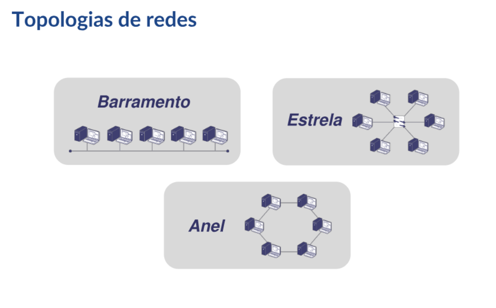

- [[RNP - Arquitetura e Protocolos de Rede TCP-IP]]
	- **Módulo 1**
		- Redes de computadores
			- Interconexão de estações de trabalho, periféricos, terminais e outros dispositivos
			- Diversas definições
				- STALLINGS e outros autores
				- Norma ISO/IEC 7498
			- Dois ou mais compuadores interligados
			- Meio físico de comunicação (hardware e software)
			- Aplicativos para transferência de informação
			- Tipos de redes
				- **Par-a-par (peer2peer)**
					- Cada computador funciona como cliente e como servidor
					- Sem hierarquia
					- Sem servidores dedicados
					- Mais simples e baratas do que as redes cliente-servidor
					- Cada peer deve utilizar uma porcentagem significativa de seus recursos para suportar o usuário local e também recursos adicionais para suportar cada usuário remoto
				- **Cliente servidor**
					- Servidores dedicados
					- Estações clientes **não** oferecem serviços à rede
					- Vantagens
						- Compartilhamento de recursos e dados
						- Redundância
						- Computador cliente mais simples
						- Escalabilidade
			- Tipos de conexões
				- **Ponto a ponto**
					- Conexão entre dois pontos
					- Enlace dedicado
					- Sem escalabilidade
				- **Multiponto**
					- Muitos pontos ligados ao mesmo meio físico
					- Mensagens propagadas por difusão
					- Escalabilidade
			- Topologia
				- 
				- **Barramento**
					- Conexões multiponto
					- Mensagens propagadas por difusão
					- Controle de acesso ao meio centralizado ou descentralizado
					- Escalabilidade
					- Limitada fisicamente pelo tamanho do barramento
					- Boa tolerância a falhas
				- **Anel**
					- Conexões ponto-a-ponto
					- Mensagens propagadas de uma estação para outra
					- Controle de acesso ao meio determinístico
					- Pouca tolerância a falhas
				- **Estrela**
					- Conexões ponto-a-ponto
					- Mensagens propagadas através do nó central
					- Controle de acesso ao meio centralizado ou descentralizado
					- Boa tolerância a falhas
					- O nó central é chamado de barramento colapsado
			- Redes LAN, MAN e WAN
				- Classificadas de acordo com
					- Topologia
					- Meios físicos
					- Tecnologias de suporte
					- Ambientes aos quais se destinam
				- **LAN**
					- Cabeamento de até 10km
					- Alta taxa de transmissão (Mbps, Gbps)
					- Baixa taxa de erros
					- Baixo custo de cabeamento
					- Propriedade privada
					- Topologia básica (barramento, anel, estrela)
				- **MAN**
				- **WAN** (Wide Area Network)
					- Cabeamento de longas distâncias (sem limite)
					- Baixa a alta velocidade de transmissão (Kbps, Mbps, Gbps)
					- Taxa de erros maior do que nas LANs
					- Alto custo de cabeamento
					- Propriedade pública
			- Meios de comunicação
				- Cabo metálico
					- Coaxial
						- Cabo fino 10Base2 com conector BNC
						- Cabo grosso 10Base5
						- Obsoleto > substituído pelo par trançado e fibra óptica
					- Par trançado
						- Qatro pares trançados dois a dois
						- Conector RJ-45 (8 fios)
						- Velocidades de 10 Mbps até 10 Gbps
						- Facilidade de manutenção
						- Vantagens
							- Preço, flexibilidade, facilidade de manutenção, velocidade
						- Desvantagens
							- Comprimento, interferẽncia
					-
				- Cabo fibra óptica
					- Velocidade 1 ~ 100Gbps
					- Conexões ponto a ponto
					- Redes LAN e MAN Ethernet
					- Imune a ruído eletromagnético
					- Bainha -> Isolamento -> Cladding -> Cobertura de fibra -> Núcleo
				- Cabeamento estruturado
					- Norma ANSI/TIA/EIA-568-B
					- Norma NBR 14565, ABNT 2001
					- Cabeamento do prédio inteiro
					- Patch panel
				- Redes sem fio
					- Motivações
						- Mobilidade
						- Facilidade de instalação
						- Escalabilidade
						- Confiabilidade
						- Custo
				-
-