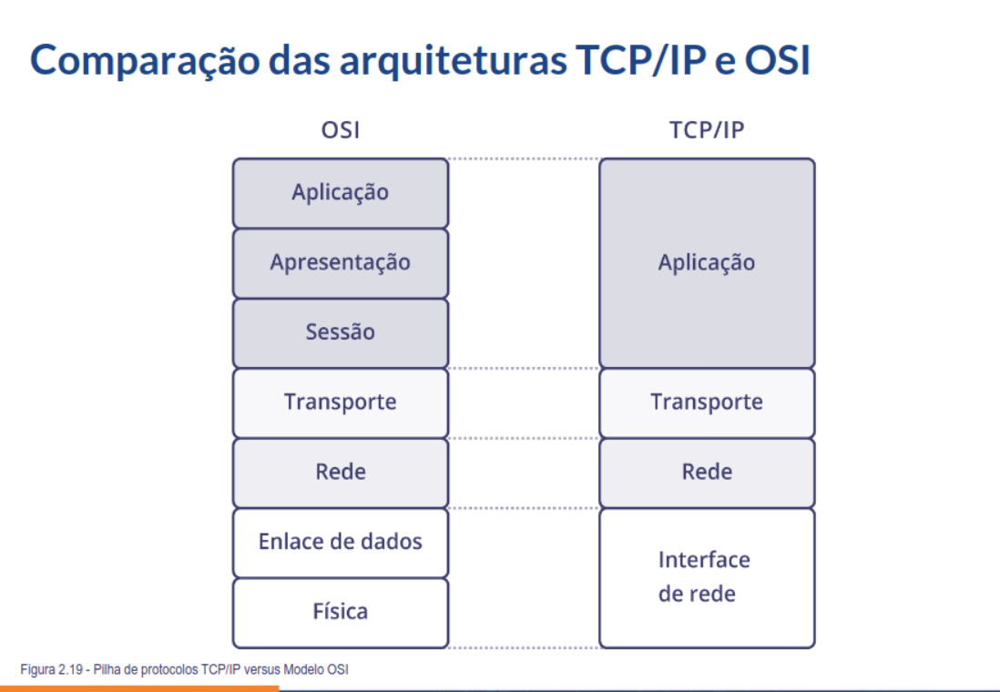

- [[RNP - Arquitetura e Protocolos de Rede TCP-IP]]
	- **Módulo 2 - Arquitetura de protocolos**
		- Conceito de protocolo
			- Conjunto de regras que controla a interação de duas máquinas ou dois processos semelhantes
			- Para que dois computadores se comuniquem, é necessário que usem o mesmo protocolo
			- Sem protocolos, o computador não pode reconstruir, no formato original, a sequência de bits recebida de outro computador
			- Suíte de protocolos (família de protocolos)
				- Coleções de protocolos que habilitam comunicação em rede de uma máquina até outra
				- Estruturada em camadas, de forma a dividir e organizar as funções de cada camada
			- Conceito de **camada**
				- Comunica-se somente com as camadas adjacentes
				- Usa serviços da camada inferior
				- Provê serviços à camada superior
			- Conceito de **interface**
				- Conjunto de regras que controla a interação de duas máquinas ou dois processos diferentes ou com funções diferentes
				- As camadas de protocolos transferem informações entre si através das interfaces
			- Modelo OSI (Open Systems Interconnection)
				- Lançado pela ISO em 1984
					- ISO: entidade que congrega institutos nacionais de padronizaçao de 140 países, trabalhando em pareria com organizações internacionais, governos, indústris e consumidores: um elo entre setores públicos e privados
				- Objetivos de um sistema aberto
					- Interoperabilidade
					- Portabilidade da aplicação
					- Interconectividade
					- Escalabilidade
				- Camada física
					- Responsável pela transmissão dos bits através de um canal de comunicação
					- Representação dos bits (nível elétrico, duração do sinal, condificação)
					- Forma e nível dos pulsos óticos
					- Mecânica dos conectores
					- Função de cada circuito do conector
				- Camanda de enlace
					- Responsável pela detecção de erros
					- Frame Check Sequence (FCS)
					- Endereços físicos de origem e destino
					- Define protocolo da camada superior
					- Topologia de rede
					- Sequência de quadros
					- Controle de fluxo
					- Connection-oriented ou connectionless
				- Camada de rede
					- Endereçamento e roteamento
					- Tratamento dos problemas de tráfego na rede: congestionamento
					- Escolha das melhores rotas através da rede
					- Define endereços lógicos de origem e destino associados ao protocolo da camada 3
					- Interconecta diferentes camadas de enlace de dados
				- Camada de transporte
					- Conectividade fim-a-fim
					- Recebe dados da camada de sessão, os divide se necessário e passa-os para a camada de rede
					- Garante que todas as partes cheguem corretamente ao destino
					- Responsável pelo término e pela criação de conexões, quando necesário
					- Identifica as aplicações de camadas superiores
					- Estabelece conectividade fim-a-fim entre aplicações
					- Oferece serviços confiáveis, ou não, para a transferência de dados
				- Camada de sessão
					- Permite que aplicações em diferentes máquinas estabeleçam uma sessão entre si
					- Gerencia o controle de diálogos, permitindo a conversação em abos os sentidos, ou em apenas um
					- Sincronização do diálogo (transferência de arquivos, programas)
				- Camada de apresentação
					- Representação da informação: sintaxe e semântica
					- Realiza certas funções de forma padrão, ex.: conversão de códigos de caracteres (EBCDIC, ASCII, etc)
					- Compressão, criptografia, codificação de inteiro, ponto flutuante etc
				- Camada de aplicação
					- Define uma variedade de protocolos necessários à comunicação
						- terminais virtuais, transferência de arquivos (FTP), correio eletrônico (SMTP, POP), VoIP, acesso remoto (telnet/ssh), gerência (SNMP)
		- **Arquitetura TCP/IP**
			- Modelo DoD (histórico)
				- Comutação de pacotes
					- Rede não confiável
					- Mensagens divididas em pedaços (pacotes)
					- Roteamento independente por pacote
					- Store and forward
					- Rede experimental ARPANET
				- Década de 70
					- Agência ARPA desenvolve estudos para interconexão de redes baseada em comutação de pacotes
					- Construção da rede ARPAnet
					- Surgem as primeiras especificações da família de protocolos TCP/IP
					- *Define os detalhes de comunicação e convenções para interconectar as redes e realizar o roteamento de tráfego*
				- Década de 80
					- 1980-1985
						- Família de protocolos TCP/IP é padronizada na ARPANET
						- ARPANET é dividida em duas redes
							- Pesquisa experimental (ARPAnet)
							- Comunicação militar (Milnet)
						- Início da emergente Internet
						- ARPA disponibiliza implementação de baixo custo do TCIP/IP e financia a integração de sistemas Unix
					- 1985-1990
						- National Science Foundation (NSF) incentiva a expansão de redes TCP/IP para a comunidade científica
						- Adoção dos protocolos TCP/IP por organizações comerciais
						- Criação do backbone da rede NSFNET
							- *Interligação de centros de supercomputação*
							- Conexão com a ARPANET
						- Crescimento do tamanho e uso da internet no mundo
			- Conceito de inter-rede
				- Funções das camadas
				- Documentos de padronização
				- Características básicas
				- Tipos de endereços (lógico e físico)
				- Modleo de interconexão
					- **Roteador**
						- Possui conexão com duas ou mais redes
						- Não provê conexão direta com todas as redes físicas
						- Roteia pacotes de uma rede para outra
						- Mantém informações de roteamento para todas as redes
						- É também denominado gateway ou sistema intermediário
					- **Estação**
						- Dispositivo do usuário conectado a alguma rede física da interrede
						- Estação multihomed pode atuar como um roteador
						- Requer ativação da função de roteamento de pacotes entre redes
						- Tabmeḿ denominada host ou sistema final
					- **Visão do usuário**
						- Usuários veem a inter-reed como uma rede virtual única à qual todos os dispositivos estão conectados
						- Usuários não conhecem as diversas redes físicas individuais
						- Adota um mecanismo de endereçamento universal, baseado em endereços IP, que permite a identificação única de cada dispositivo da inter-rede
				- Camada Transporte
					- **TCP (Transmission Control Protocol)**
						- Orientado a conexão
						- Provê fluxo confável de dados
						- Divide o fluxo de daos em segmentos
					- **UDP (User Datagram Protocol)**
						- Provê serviço de datagrama não confiável
				- Camada de rede
					- Realiza tranferência e roteamento de pacotes entre dispositivos da inter-rede
					- **IP (Internet Protocol)**
						- Provê serviço de datagrama não confiável
						- Envia, recebe e roteia datagramas IP
					- **ICMP (Internet Control Message Protocol)**
						- Permite a troca de informações de erro e controle entre camadas de rede de estações distintas
				- Camada de interface de rede
					- Compatibiliza a tecnologia da rede física com o protocolo IP
					- Aceita datagramas IP e transmite na rede física sob a forma de quadros
					- Trata os detalhes de hardware da conexão física e transmissão de dados
					- Geralmente inclui o driver de dispositivo e a placa de rede
			- **Endereços físicos e lógicos**
				- Endereço físico
					- Endereço da estação do usuário na rede física
					- Somente identifica o equipamento, não a rede
					- Não é roteável entre as redes físicas
					- Exemplo: endereço MAC Ethernet
				- Endereço lógico
					- Identifica a rede física e a estação do usuário na rede
					- É roteável entre as redes físicas
					- Exemplo: endereço IP
			- 
				-
				-
-
-