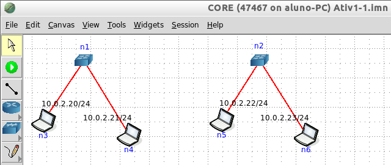

- [[RNP - Arquitetura e Protocolos de Rede TCP-IP]]
	- **Atividade 1.1 - Rede par-a-par**
		- 
		- Essa rede é constituída por 2 switches (n1 e n2) cada um com dois PCs (n3 e n4, n5 e n6). Cada switch com seus respectivos PCs constitui uma rede par-a-par, como vimos na parte teórica desta sessão.
		- Cada PC está configurado com um endereço IPv4 da rede 10.0.2.0/24, de forma que todos estão na mesma rede local, **embora os switches estejam fisicamente separados, constituindo duas redes locais par-a-par.**
		-