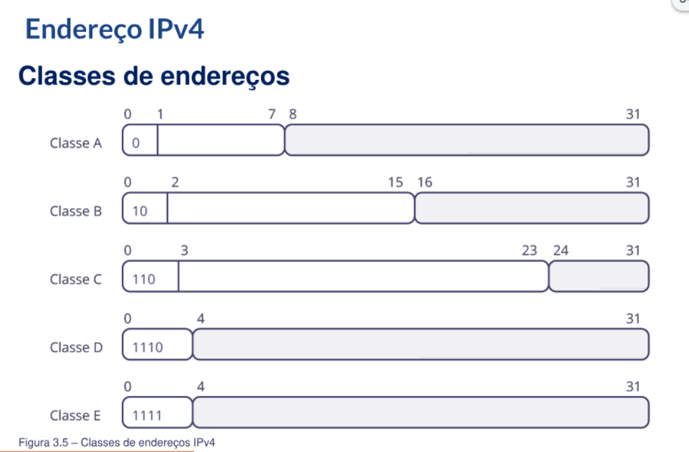

- [[RNP - Arquitetura e Protocolos de Rede TCP-IP]]
	- **Módulo 3**
		- IPv4
			- Hierarquia de endereçamento
				- Identificador de rede (prefixo de rede)
					- Identifica cada rede de forma única e individual
				- Identificador de estação
					- Identifica cada estação da rede de forma única e individual
			- Regras de atribuição de endereços
				- Diferentes prefixos de redes devem ser adotados para diferentes redes físicas
				- Um único prefixo de rede deve ser compartilhado por interfaces de uma rede física
				- Um único identificador de etação deve ser atribuído a cada interface de uma rede física
			- Classes de endereços
				- 
				- Endereços das interfaces de um roteador
					- 200.150.10.10
					- 20.1.1.10
					- 150.10.1.100
				- Classe?
				- Máscara de rede padrão?
			- Máscar de rede
				- Notação de contagem de bits
					- Representada por um número inteiro que indica a quantidade de bits 1 da máscara
				- Notação decimal
					- Representada por 4 números decimais separados por pontos
					- Cada número decimal está associado a um determinado byte da máscara
			- **Protocolo DHCP**
				- Atribuir endereços IP às estações de forma automática
				- Também são utilizados para carregar informações como máscara de rede e rota default
				- Client: DISCOVERY (broadcast)
					- Feito o broadcast pra poder descobrir qual é o servidor DHCP
				- Server: OFFER (unicast)
				- Client: REQUEST (broadcast)
					- É feito um broadcast pra poder informar aos demais clients o seu novo IP, para que possam atualizar as tabelas etc.
				- Server: ACK (unicast)
			- **Desperdício de endereços**
				- Esquema de endereçamento IPv4 original é *inviável tecnicamente*
					- Cada rede física deve ter um prefixo de rede único
					- Analogia: duas ruas com nomes distintos
				- Solução
					- Compartilhar um único endereço de rede entre múltiplas redes físicas
				- Objetivos
					- Minimizar o desperdício de enderços
					- Maximizar o tempo de vida do espaço de endereçamento de 32 bits
				- **Sub-redes**
					- Permitem compartilhar um único endereço de rede entre diversas redes físicas
					- Minimizam o desperdício de endereços
					- Exemplo: rede Classe B 172.16.0.0 pode ser dividida em 256 sub-redes Classe C
					- Hierarquia de endereçamento
						- Identifica, juntamente com o identificador de rede, cada rede física de forma individual e única
						- A concatenação dos indentificadores de rede e sub-rede é denominada prefixo de sub-rede
		-
-