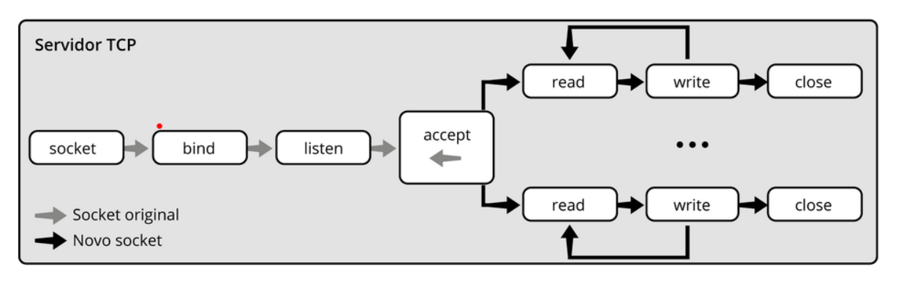

- [[RNP - Arquitetura e Protocolos de Rede TCP-IP]]
	- **Módulo 9: Camada de aplicação**
		- Não tem um único protocolo
		- As aplicações determinal qual ou quais protocolos serão utilizados
		-
		- Fundamentos da camada de aplicação
			- Trata os detalhes específicos de cada tipo de aplicação
				- Mensagens trocadas por cada tipo de aplicação definem um protocolo de aplicação
				- Cada protocolo de aplicação especifica a sintaxe e a sem}antica de suas mensagens
			- Diversos protocolos de aplicação
				- FTP, SMTP, DNS, HTTP
			- Implementada via processos de aplicação
			- Processos interagem usando o modelo cliente-servidor
			- Processos usam os serviços das camada de transporte
			- Processos interagem com as implementaçoes dos protocolos de transporte, através de uma API
			- A interface socket é um dos principais exemplos de interface de interação
		- Modelo cliente-servidor
			- Componentes
				- Servidor
					- Processo que oferece um serviço que pode ser requisitado pelos clientes através da rede
					- Comunica-se com o cliente somente após receber requisição
					- Executa continuamente
				- Cliente
					- Processo que requisita um serviço oferecido por um servidor
					- Inicia a interação com o servidor
					- Disponibiliza a interface para o usuário
					- Finaliza a execução após ser utilizado pelo usuário
			- Identificação de clientes e servidores
				- Clientes e servidores são identificados por meio de portas
				- Servidor não precisa conhecer, previamente, a porta usada pelo cliente
				- Cliente deve conhecer, previamente, a porta usada pelo servidor
				- Servidor descobre a porta usada pelo cliente somente após receber a requisição
				- Portas são permanentemente reservadas para serviços padronizados e bem conhecidos
					- `Porta 53 (DNS)`
					- `Porta 161 (SNMP)`
				- Portas reservadsa são utilizadas pelos servidores que implementam os respectivos serviços
				- Demais portas são disponíveis para os clientes
		- Interface **socket**
			- Socket
				- Representação interna do OS para um ponto de comunicação
			- Amplamente adotada em diversas plataformas e linguagens
			- Ponto de comunicação
				- Identificado pelos endpoints remoto e local
				- Cada endpoint é representado pelo par (endereço IP, porta)
			- Estados de um socket
				- Ativo
					- Usado pelo **cliente** para enviar ativamente requisições de conexão ao servidor
				- Passivo
					- Usado pelo **servidor** para aguardar passivamente por requisições de conexão
			- Tratamento de endpoints
				- Endpoint local
					- Criado por default com o endereço IP especial `0.0.0.0` e uma porta arbitraria, selecionad pelo OS
					- Pode ser atribuído um endereço IP e uma porta específica
						- Endereço IP específico deve ser evitado em sistemas multihomed, execto por questões de segurança
						- Servidor deve configurar uma porta específica
						- Cliente usa a porta selecionada pelo OS
			- Implementação
				- Modelo de programação
					- Explora chamadas ao sistema operacional
					- Adota o modelo de arquivo baseado no paradigma abrir-ler-escrever-fechar
					- Principais funções
						- Socket
							- cria novo socket
						- Bind
							- associa endereço IP e porta ao endpoint local do socket
						- Listen
							- Indica que o socket está pronto para receber conexão
						- Accept
							- bloqueia o processo até a chegada de conexão
						- Connect
							- estabelece conexão com endpoint remoto
						- Read / Recvfrom
							- lê dados de um socket TCP/UDP
						- Write
							- ?
				- Clientes e servidores UDP
					- Baseados em datagramas
					- Bind associa a porta específica ao endpoint local
					- Recvfrom processa as mensagens recebidas
					- Mapeados sobre protocolo UDP
					- Endereço 0.0.0.0 reservado ao endpoint local
					- O servidor envia uma resposta com sendto
				- Clientes e servidores TCP
					- Orientado à conexão
					- Baseado em circuitos virtuais
					- Cria um novo socket a cada nova requisição
		- Servidores de aplicação
			- Servidor iterativo (single threaded)
				- Trata requisições de um único cliente a cada instante
				- Implementado como um único processo
					- Adequado para serviços com reduzida taxa de requisições e serviços cujas requisições possuem baixa carga de processamento
			- Servidor concorrente (multi-threaded)
				- Implementado com vários processos independentes
				- Trata simultaneamente requisições de vários clientes
				- Cada processo trata indivudlamente as requisições
				- Adequado para serviços com elevada taxa de requisições e serviços cujas requisições possuem alta carga de processamento
				- 
			- Compartilhamento de portas
				- Servidor concorrente
					- Existe um único socket no estado listen
						- Somente processa segmentos SYN
					- Podem existir diversos sockets no estado established
						- Somente processam segmentos de dados
					- Socket do mestre
						- Está sempre no estado listen
						- Endpoint local possui o endereço especial 0.0.0.0 e a porta específica do servidor
						- Endpoint remoto possui o endereço especial 0.0.0.0 e a porta `* `
						-
					- Sockets dos escravos
						- Estão sempre no estado established
						- Endpoints locais possuem endereço IP da estação e a porta específica do servidor
						- Endpoints remotos possuem os endereços IP e as portas dos respectivos clientes
			- Gerenciamento de conexões TCP
				- Fila de requisições
					- Associada a sockets TCP no estado listen
					- Possui capacidade fixa, mas pode ser configurada pelo servidor com a função listen
					- Armazena requisições de conexão que já foram aceitas pela entidade TCP
						- Processamento da requisição é realizado pela entidade TCP e não pelo servidor
						- Requisição presente na fila ainda não foi aceita pelo servidor
						- Requisição somente é aceita e removida da fila quando o servidor ativa a função accept
			- Multiplicidade de serviços
				- Servidor de um serviço único
					- Aguarda requisições de conex~çao em um único socket
					- Implementação baseada na função **accept**
				- Servidor de múltiplos serviços
					- Aguarda requisições de conexão em dicersos sockets, que possuem diferentes portas associadas aoas respectivos endpoints locais
					- Implementação baseada na função **select**
					-
					-
				-
				-